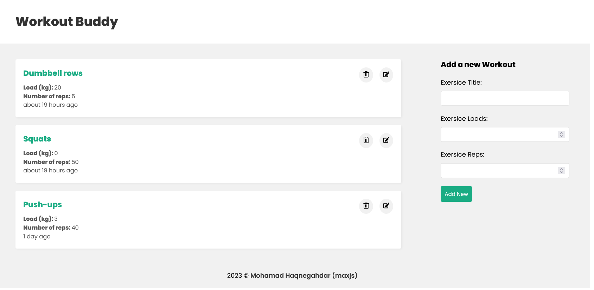

# My Workout - MERN

This is a basic MERN crud project bootstrapped with [`Vite`](https://vitejs.dev/).

explore the demo [here](https://maxjn-my-workout.vercel.app/)

## Technologies

- JSX, Css,
- ES6
- React
- **MongoDB,Express,Nodejs**
- **Packages:** mongoose, exptrss, react-icon
- **Routing:** react-router-dom

## Features

- Adding workouts
- deleting workouts
- updating workouts
- getting workouts

## Installation

Install **My Workout** with npm

###### frontend

```shell
npm install

npm run dev
```

###### backend

```shell
npm install

npm run dev
```

## Screenshots


